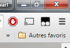
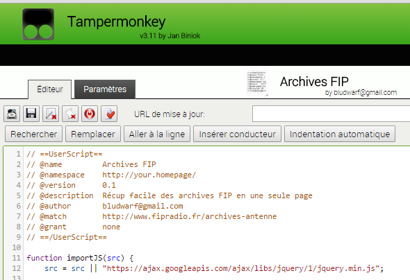
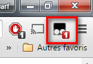
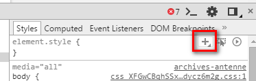
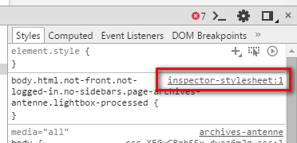

# FIP
Pour voir les archives antennes de la radio FIP de manière plus sympathique.

Exemple de rendu une fois le userscript chargé avec TamperMonkey et le CSS avec l'inspector-stylesheet de Chrome.

# Installation
Installer l'extension Chrome "TamperMonkey".

Se rendre sur FIP (archives antenes) puis cliquer sur le bouton de TamperMonkey en haut à droite de Chrome.

Cliquer sur "Ajouter un nouveau script" puis remplacer le contenu du script par le fichier [fip-grid.js](fip-grid.user.js).

Le script est alors chargé à chaque fois que vous retournez sur cette page de FIP. TamperMonkey vous le confirme en ajoutant un petit point rouge sur son icone en haut à droite.

# Ajout du CSS

Une fois le script chargé avec TamperMonkey ouvrez les outils Web de Chrome avec `F12`.
Sur n'importe quel élément ajouter un style personnalisé en cliquant sur le petit plus tout en haut à droite.

Cliquer ensuite sur le lien `inspector-stylesheet` pour ouvrir la feuille de style courant de Chrome.

Remplacer tout le contenu par le CSS du fichier [styles.css](styles.css).
